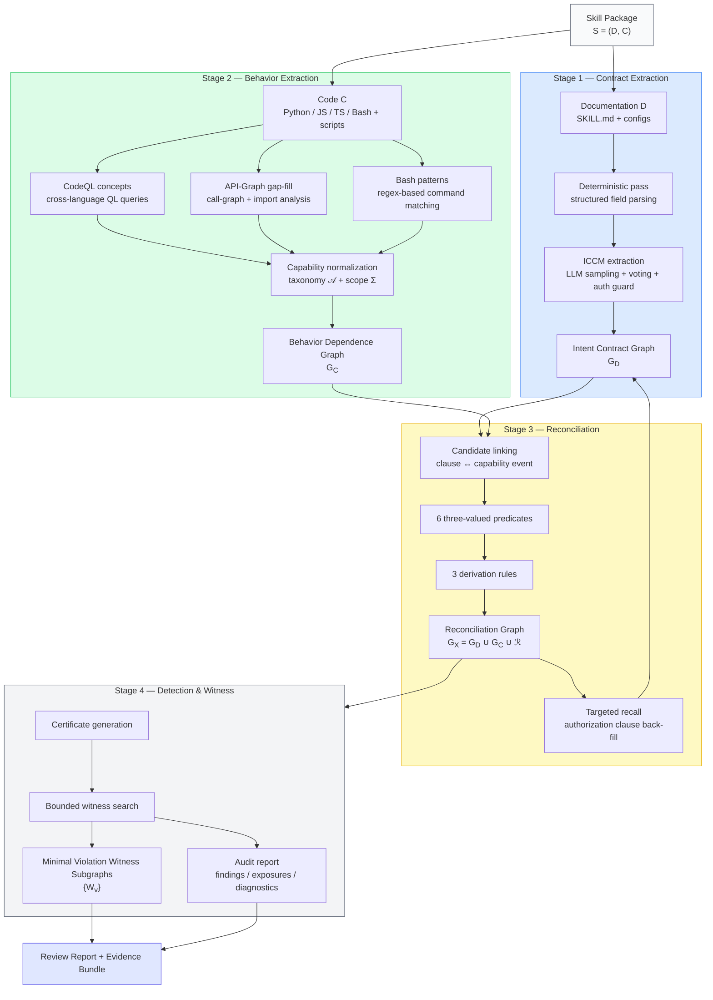

# SkillRecon

> **SkillRecon: Witnessing Intent-Behavior Inconsistency in Agent Skills via Contract Graph Reconciliation**

SkillRecon verifies whether an agent skill's implementation faithfully realizes its documented
intent. Given a skill package — documentation, configuration, source files, scripts, and inline
code blocks — SkillRecon constructs a **contract graph** ($G_D$) from the documentation side,
a **behavior graph** ($G_C$) from the implementation side, and a proof-carrying
**reconciliation graph** ($G_X$) that records whether each observed behavior is authorized,
contradicted, or unresolved by the documented contract. The output includes structured findings,
exposures, diagnostics, and **minimal violation witness subgraphs** — inspectable evidence that
pinpoints exactly where intent and behavior diverge.

## Overview

Agent skills present a unique verification challenge: a skill's documentation describes what
it *should* do, but the implementation may silently exceed those boundaries. Existing
approaches either scan for known malicious patterns or check coarse-grained capability
containment — neither answers whether a specific documented clause actually authorizes a
specific observed behavior.

SkillRecon addresses this through **cross-modal graph reconciliation**:

1. **Contract Extraction** — An LLM-based extractor (ICCM) induces structured authorization
   clauses from SKILL.md and supporting documents, producing the Intent Contract Graph $G_D$.
2. **Behavior Extraction** — A tiered static analyzer lifts code-level capabilities across
   Python, JavaScript/TypeScript, and Bash into the Behavior Dependence Graph $G_C$.
3. **Reconciliation** — Six three-valued predicates evaluate candidate clause-to-behavior
   links, yielding the Reconciliation Graph $G_X$ where every cross-modal edge carries a
   verifiable truth status.
4. **Witness Generation** — Bounded search over $G_X$ produces **minimal violation witness
   subgraphs** — compact, self-contained evidence that traces a specific documentation clause
   to the code behavior that violates it.

The result is not a suspicious/benign verdict, but an inspectable, replayable evidence
bundle: what was promised, what was done, and exactly where the two diverge.

## Pipeline



## Repository Layout

```text
SkillRecon/
├── src/skillrecon/           Core implementation
│   ├── core/                 Shared types, enums, frozen configuration
│   ├── loader/               Package scanning, inline extraction, path resolution
│   ├── contract/             ICCM clause extraction, classification, voting, G_D
│   ├── behavior/             CodeQL + Bash + instruction observation, normalization, G_C
│   ├── reconcile/            Candidate linking, 3-valued predicates, derivation, G_X
│   ├── detect/               Findings, minimal violation witnesses, validation
│   ├── evaluation/           Metrics, statistics, tables, figures, human audit
│   ├── llm/                  OpenAI-compatible client with disk cache
│   └── visualize/            PyVis rendering and explanatory subgraphs
├── scripts/                  CLI entry points (pipeline, evaluation, baselines, utilities)
├── tests/                    Test suite
├── experiments/
│   ├── configs/              Taxonomy, overlap policy, Bash patterns, LLM/env configs
│   ├── prompts/iccm/         Contract-extraction prompt templates
│   └── codeql/queries/       Python and JavaScript/TypeScript CodeQL queries
└── data/
    ├── skill_dataset/        Bundled case-study skill packages
    ├── evaluation/           Paper dataset: 500 skills × 3 risk levels + gold labels
    └── test_index/           Curated test-sample indexes
```

## Requirements

- Linux or WSL, Python 3.12+
- CodeQL CLI (only required to rerun behavior extraction from source)
- An OpenAI-compatible LLM endpoint (only required to rerun contract extraction)

## Installation

```bash
python -m venv .venv && source .venv/bin/activate
pip install -e ".[dev]"
```

Verify the installation:

```bash
python scripts/check_submission_artifact.py
```

Dependencies are listed in `requirements.txt` (runtime) and `requirements-dev.txt`
(development).

## Configuration

Copy and edit the two config files under `experiments/configs/`:

- `env_config.json` — CodeQL binary path and reconciliation knobs.
- `llm_config.json` — OpenAI-compatible LLM endpoint for contract extraction.

```json
{
  "base_url": "https://your-endpoint/v1",
  "model": "your-model-name",
  "api_key_env": "SKILLRECON_API_KEY",
  "temperature": 0.0,
  "max_tokens": 8192,
  "structured_output_mode": "json_prompt"
}
```

`base_url` should stop at the API version root (do not include `/chat/completions`).
Any OpenAI-compatible provider works. Set your API key in the environment:

```bash
export SKILLRECON_API_KEY="YOUR_API_KEY"
```

## Quick Start: Single Skill

Run the full pipeline on one bundled skill:

```bash
# 1. Contract + behavior extraction + reconciliation + detection
python scripts/run_full.py \
  --skill youtube-summary \
  --data-root data/skill_dataset \
  --output-dir derived/reviewer_cases \
  --env-config experiments/configs/env_config.json \
  --llm-config experiments/configs/llm_config.json \
  --n-samples 1 \
  --render-pyvis \
  --no-pyvis-full-graph

# 2. Evaluation and unified report
python scripts/run_evaluation.py \
  --skill youtube-summary \
  --artifact-dir derived/reviewer_cases/youtube-summary

# 3. Human-readable Markdown report
python scripts/render_markdown_report.py \
  --skill youtube-summary \
  --artifact-dir derived/reviewer_cases/youtube-summary
```

## Case Studies

The bundled 10-case set covers violations, declared exposures, and benign controls:

```bash
python scripts/run_reviewer_cases.py --render-pyvis
```

Outputs land under `derived/reviewer_cases/<skill-id>/`.

## Reading the Outputs

| Priority | File                                                          | Purpose                                                                |
| -------- | ------------------------------------------------------------- | ---------------------------------------------------------------------- |
| 1        | `review_report.md`                                          | Human-readable summary; violation / exposure status at a glance. |
| 2        | `report.json`                                               | Machine-readable unified report.                                       |
| 3        | `witnesses.json`                                            | Validated witnesses; the evidence-chain entry point.                   |
| 4        | `witness_validation.json`                                   | Whether each witness passed revalidation.                              |
| 5        | `viz/<witness-id>-explanatory.html`                         | Minimal explanatory subgraph for one finding.                          |
| 6        | `findings.json` / `exposures.json` / `diagnostics.json` | Fine-grained structured outputs.                                       |
| 7        | `g_d.json` / `g_c.json` / `g_x.json`                    | The three graph artifacts.                                             |

## Batch Experiments

The paper evaluates on 500 skills per risk level (low / medium / high, 1,500 total).
Corpus indexes and gold labels are bundled under `data/evaluation/`. To reproduce:

```bash
# 1. Per-skill artifacts (resumable; completed skills are skipped unless --force)
python scripts/run_paper_artifacts.py \
  --paper-dataset data/evaluation/skill_paper500_dataset \
  --dataset-root data/skill_dataset \
  --output-dir derived/paper500 \
  --staging-root derived/paper500_source_links \
  --llm-config experiments/configs/llm_config.json \
  --max-workers 4

# 2. Ablation artifact roots
python scripts/build_ablation_artifacts.py \
  --skills-file data/evaluation/skill_paper500_dataset/all_skills.txt \
  --data-root derived/paper500_source_links \
  --artifact-root derived/paper500 \
  --output-root derived/ablations/paper500 \
  --llm-config experiments/configs/llm_config.json

# 3. Unified experiment runner (RQ1–RQ4, baselines, ablations, extended analyses)
python scripts/run_experiments.py \
  --paper-dataset data/evaluation/skill_paper500_dataset \
  --artifact-root derived/paper500 \
  --system-artifact-root ablation_no_iccm=derived/ablations/paper500/ablation_no_iccm \
  --system-artifact-root ablation_no_scope_constraints=derived/ablations/paper500/ablation_no_scope_constraints \
  --system-artifact-root ablation_no_composition_analysis=derived/ablations/paper500/ablation_no_composition_analysis \
  --system-artifact-root ablation_no_authorization_guard=derived/ablations/paper500/ablation_no_authorization_guard \
  --output-dir derived/experiments/paper500

# 4. Bootstrap CIs and McNemar/Holm significance
python scripts/compute_rq2_statistics.py \
  --gold-labels data/evaluation/skill_paper500_dataset/gold_labels.jsonl \
  --artifact-root derived/paper500 \
  --output-dir derived/experiments/paper500/rq2_stats
```

## License

MIT. See `LICENSE`.
